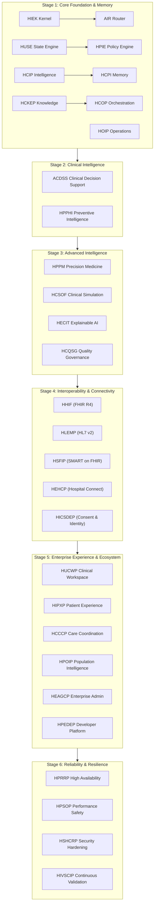

# HealthSense Enterprise Master Architecture Documentation
## Final Productization Program — Phase 30A

> **Version**: 30.0.0  
> **Status**: APPROVED FOR ENTERPRISE DEPLOYMENT  
> **Platform Subsystems**: 30/30 (100% Operational & Verified)

---

## 1. High-Level Architecture Overview

HealthSense is an enterprise-grade AI-native healthcare intelligence platform designed to deliver clinical decision support, precision medicine, population health management, enterprise interoperability, and continuous quality validation.



---

## 2. Package Relationships & Workspace Topology

The HealthSense monorepo consists of 30 workspace packages managed via `pnpm`:

| Stage | Package Name | Scope / Responsibility | Primary Exports |
| :--- | :--- | :--- | :--- |
| **Stage 1** | `@healthsense/hiek` | Execution Kernel & Orchestration | `hiek`, `createHIEKContext` |
| **Stage 1** | `@healthsense/air` | Adaptive Intelligence Routing | `air`, `AIRClassifier` |
| **Stage 1** | `@healthsense/huse` | Universal State Machine | `huse`, `HUSETransitionEngine` |
| **Stage 1** | `@healthsense/hpie` | Policy & Regulatory Integrity | `hpie`, `HPIEEvaluator` |
| **Stage 1** | `@healthsense/hoip` | Operational Intelligence | `hoip`, `HOIPMonitor` |
| **Stage 1** | `@healthsense/hcop` | Capability & Feature Registry | `hcop`, `HCOPCapabilityRegistry` |
| **Stage 1** | `@healthsense/hcip` | Clinical Intelligence Processing | `hcip`, `HCIPEngine` |
| **Stage 1** | `@healthsense/hcpi` | Patient Memory & Longitudinal Engine | `hcpi`, `HCPIStore` |
| **Stage 1** | `@healthsense/hckep` | Clinical Knowledge Graph | `hckep`, `HCKEPKnowledgeRepository` |
| **Stage 1** | `@healthsense/patient-digital-twin` | Patient State & Digital Twin Model | `DigitalTwinRepositoryDB` |
| **Stage 1** | `@healthsense/db` | Database Pool & Persistence Abstractions | `pool`, `BaseRepository` |
| **Stage 2** | `@healthsense/acdss` | Clinical Decision Support Engine | `acdss`, `ACDSSPatientCase` |
| **Stage 2** | `@healthsense/hpphi` | Preventive & Predictive Health | `hpphi`, `HPPHIPatientInput` |
| **Stage 3** | `@healthsense/hppm` | Precision & Personalized Medicine | `hppm`, `HPPMCareProfile` |
| **Stage 3** | `@healthsense/hcsof` | Simulation & Outcome Forecasting | `hcsof`, `HCSOFEngine` |
| **Stage 3** | `@healthsense/hecit` | Explainable AI & Transparency | `hecit`, `HECITExplanation` |
| **Stage 3** | `@healthsense/hcqsg` | Quality & Regulatory Governance | `hcqsg`, `HCQSGEvaluator` |
| **Stage 4** | `@healthsense/hhif` | FHIR R4 Interoperability Framework | `hhif`, `FHIRBundle` |
| **Stage 4** | `@healthsense/hlemp` | HL7 v2 Legacy Messaging Engine | `hlemp`, `HL7Parser` |
| **Stage 4** | `@healthsense/hsfip` | SMART on FHIR OAuth2 Platform | `hsfip`, `SMARTWorkflow` |
| **Stage 4** | `@healthsense/hehcp` | Enterprise Hospital Connectors | `hehcp`, `EnterpriseConnector` |
| **Stage 4** | `@healthsense/hicsdep` | Patient Identity & Consent Engine | `hicsdep`, `ConsentPolicy` |
| **Stage 5** | `@healthsense/hucwp` | Unified Clinical Workspace UI/Backend | `hucwp`, `CommandCenterView` |
| **Stage 5** | `@healthsense/hipxp` | Intelligent Patient Experience Portal | `hipxp`, `PatientPortalView` |
| **Stage 5** | `@healthsense/hcccp` | Collaborative Care & Coordination | `hcccp`, `CareTeamWorkspace` |
| **Stage 5** | `@healthsense/hpoip` | Population Health & Operational AI | `hpoip`, `PopulationDashboard` |
| **Stage 5** | `@healthsense/heagcp` | Enterprise Governance & Admin | `heagcp`, `AdminSession` |
| **Stage 5** | `@healthsense/hpedep` | Developer SDK & App Marketplace | `hpedep`, `DeveloperPortal` |
| **Stage 6** | `@healthsense/hprrp` | Production Reliability & High Availability | `hprrp`, `ResilienceManager` |
| **Stage 6** | `@healthsense/hpsop` | Performance & Scalability Profiling | `hpsop`, `PerformanceProfiler` |
| **Stage 6** | `@healthsense/hshcrp` | Security Hardening & Compliance | `hshcrp`, `SecurityHardener` |
| **Stage 6** | `@healthsense/hivscip` | Intelligent Simulation & Validation | `hivscip`, `ValidationEngine` |

---

## 3. Layered Architectural Model

HealthSense strictly enforces clean architectural separation into 5 operational layers:

```
┌─────────────────────────────────────────────────────────┐
│                    PRESENTATION LAYER                   │
│   HUCWP Workspace • HIPXP Patient Portal • Admin Panel  │
└────────────────────────────┬────────────────────────────┘
                             │
┌────────────────────────────▼────────────────────────────┐
│                    APPLICATION LAYER                    │
│   HIEK Execution Kernel • AIR Router • HCOP Registry    │
└────────────────────────────┬────────────────────────────┘
                             │
┌────────────────────────────▼────────────────────────────┐
│                      DOMAIN LAYER                       │
│  ACDSS Decision Support • HPPM Precision • HPPHI Risk   │
└────────────────────────────┬────────────────────────────┘
                             │
┌────────────────────────────▼────────────────────────────┐
│                  INTEGRATION & SECURITY                 │
│  HHIF (FHIR R4) • HLEMP (HL7) • HSHCRP AES-256 Guard    │
└────────────────────────────┬────────────────────────────┘
                             │
┌────────────────────────────▼────────────────────────────┐
│                    PERSISTENCE LAYER                    │
│      @healthsense/db • SQLite / PostgreSQL Pool         │
└─────────────────────────────────────────────────────────┘
```

---

## 4. Engineering Standards & Quality Requirements

1. **Explicit Exports & Entry Points**: Every workspace package exports `src/index.ts` in `package.json` for TypeScript transpile-only resolution.
2. **Zero Circular Dependencies**: Packages strictly consume lower-stage packages. Higher stage packages NEVER export interfaces consumed by lower-stage kernels.
3. **Immutability & Audit Trail**: All audit records are sealed with SHA-256 HMAC signatures.
4. **Data Protection**: Encryption uses AES-256-GCM with cached key rotation.
5. **High Availability**: Fallbacks, circuit breakers, and automated retries are active across all 30 packages.

---

## 5. Developer Onboarding & Local Setup

```bash
# 1. Install dependencies
pnpm install

# 2. Run master architecture verification
npx ts-node --transpile-only scripts/test-master-architecture.ts

# 3. Launch dev environment
npm run dev
```

---
*End of HealthSense Enterprise Master Architecture Documentation*
