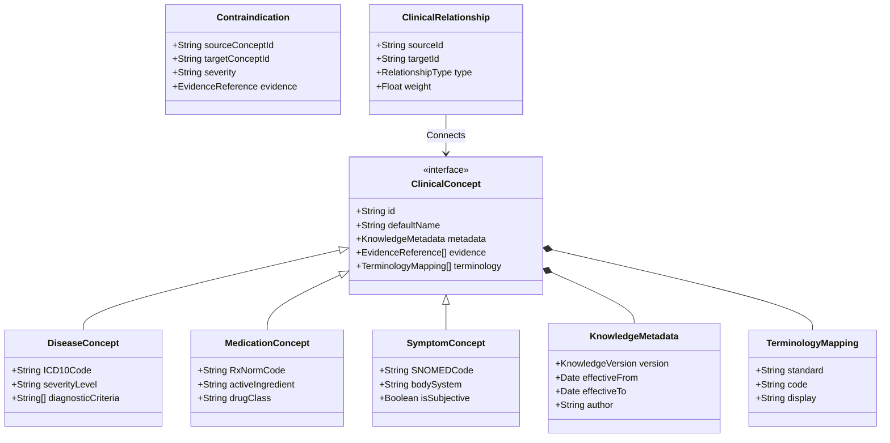

# Clinical Knowledge Fabric (CKF)
## Architecture & Design Specification (ADS) - Part 2

> [!NOTE]
> This document details Section 3 of the ADS: The CKF Domain Model.

---

## SECTION 3 — DOMAIN MODEL

The CKF domain model defines the canonical, immutable knowledge structures that the HealthSense platform relies upon.

### Mermaid Class Diagram

### Immutable Domain Entities

#### 1. `ClinicalConcept` (Abstract Base)
- **Purpose:** The root interface for all medical concepts.
- **Responsibilities:** Holds identity, names, metadata, and mapping data.
- **Invariants:** Must have a globally unique `id` and at least one `EvidenceReference`.

#### 2. Specialized Concepts
- **`DiseaseConcept`**: Represents a pathology (e.g., Type 2 Diabetes).
- **`MedicationConcept`**: Represents a pharmaceutical intervention.
- **`SymptomConcept`**: Represents a clinical manifestation.
- **`RiskFactor`**: Represents demographic, genetic, or environmental risks.
- **`LaboratoryConcept`**: Represents lab metrics and their standard reference ranges.
- **`LifestyleConcept`**: Represents behavioral habits (e.g., smoking).
- **`InterventionConcept`**: Represents non-pharmaceutical interventions (e.g., surgery, diet).

#### 3. Relationships & Guidelines
- **`ClinicalRelationship`**: Directed edge between concepts (e.g., Symptom -> Disease `INDICATES`). 
- **`RelationshipType`**: Enum defining the semantic edge (e.g., `TREATS`, `CAUSES`, `EXACERBATES`).
- **`Contraindication`**: A strict sub-type of relationship indicating two concepts cannot safely co-exist.
- **`ClinicalGuideline`**: A structured recommendation model (e.g., ADA Diabetes Care Pathway).

#### 4. Ontological Context
- **`OntologyNode`**: Represents a position in a hierarchical tree (e.g., "Viral Infection" is a parent of "Influenza").
- **`TerminologyMapping`**: Associates an internal CKF concept with external standards (ICD-10, SNOMED).

#### 5. Provenance & Versioning
- **`KnowledgeSnapshot`**: The state of the entire fabric at a given timestamp.
- **`KnowledgeVersion`**: Semantic versioning identifier (e.g., `v2.4.1`).
- **`EvidenceReference`**: Pointer to the source material (e.g., DOI, PubMed ID).
- **`KnowledgeSource`**: The organizational body providing the knowledge (e.g., WHO, FDA).
- **`KnowledgeMetadata`**: Wrapper for version, effective dates, and audit info.

### Lifecycle & Ownership
All domain entities are strictly owned by the `CKF Domain Layer`. They are instantiated via factories that enforce invariants (e.g., a `MedicationConcept` cannot be created without a valid `KnowledgeMetadata` tag). Once created, they are **immutable**. Updates generate entirely new concept records with incremented version metadata.
