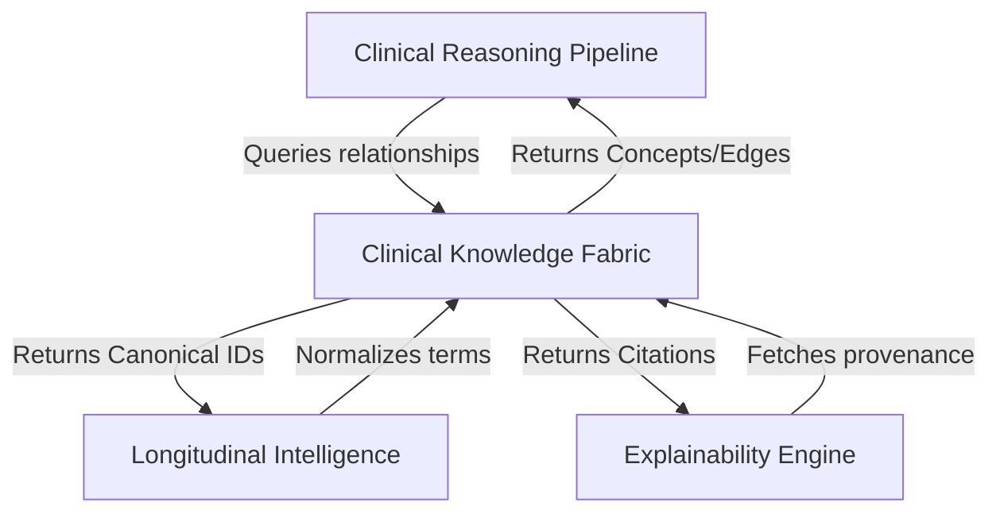

# Clinical Knowledge Fabric (CKF)
## Architecture & Design Specification (ADS) - Part 4

> [!NOTE]
> This document details Sections 6 and 7 of the ADS: Integration Architecture and Knowledge Lifecycle.

---

## SECTION 6 — INTEGRATION ARCHITECTURE

The CKF operates as a centralized hub. It does not push data; it acts as a highly-available, read-heavy query engine for the rest of the platform.

### Component Interactions

1. **Clinical Reasoning Pipeline (Phase 12 Integration)**
   - *Flow:* When the CRP generates a `ClinicalHypothesis`, it queries the CKF's `RelationshipTraversalService` to identify potential contraindications or required evidence points.
   - *Result:* CRP blocks unsafe paths immediately using deterministic knowledge boundaries.

2. **Longitudinal Intelligence Engine (Phase 13 Integration)**
   - *Flow:* The LCIE queries the `TerminologyService` to normalize messy historical data from the Digital Twin (e.g., standardizing "High BP" to `SCT:38341003`).
   - *Result:* LCIE trajectory models calculate slopes based on canonical, harmonized concepts.

3. **Patient Digital Twin**
   - *Flow:* The Twin does not communicate directly with the CKF. The Workflow Runtime resolving the Twin queries the CKF for display mappings (e.g., "What is the patient-friendly name for RxNorm:1234?").

4. **Explainability Engine & Confidence Engine**
   - *Flow:* Explainability Engine queries the `EvidenceProvenanceService` to append academic citations (DOIs, Guidelines) to its explanations.
   - *Result:* Explanations shift from "AI thinks X" to "Guideline Y recommends X".

### Data Flow Diagram (Mermaid)

---

## SECTION 7 — KNOWLEDGE LIFECYCLE

Knowledge is not static, but it must be managed immutably to preserve replayability.

### The 8-Stage Lifecycle

1. **Knowledge Ingestion**
   - Import pipelines extract facts from authoritative sources (SNOMED CT releases, FDA drug databases, localized hospital guidelines).
   - *State:* `DRAFT`

2. **Validation**
   - Automated constraints verify that relationships don't create logical paradoxes (e.g., A exacerbates B, but B treats A).
   - *State:* `VALIDATING`

3. **Normalization**
   - Concepts are mapped to the canonical internal IDs. Unmapped concepts are flagged for human review.
   - *State:* `NORMALIZED`

4. **Versioning & Snapshotting**
   - An atomic version (e.g., `v3.1.0`) is cut. A `KnowledgeSnapshot` object is created with an `effectiveFrom` timestamp.
   - *State:* `VERSIONED`

5. **Publication**
   - The snapshot goes live. `ConceptResolutionService` begins routing queries matching current timestamps to this version.
   - *State:* `ACTIVE`

6. **Deprecation**
   - When a new version is published, the previous version's `effectiveTo` timestamp is locked. 
   - *State:* `DEPRECATED`

7. **Archiving**
   - Extremely old versions may be migrated to cold storage, but they can *never* be deleted.
   - *State:* `ARCHIVED`

8. **Replay**
   - When the Replay Engine audits a past decision, it requests the CKF to load a `DEPRECATED` or `ARCHIVED` snapshot based on the historical `contextDate`.
