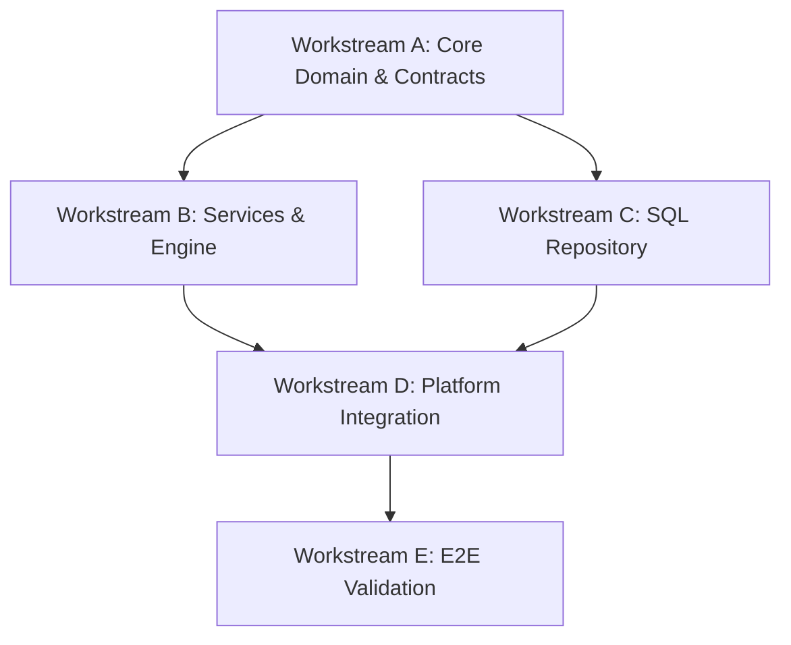

# Clinical Knowledge Fabric (CKF)
## Implementation Planning & Execution Blueprint (IPEB) - Part 2

> [!NOTE]
> This document details Sections 3 and 4: Implementation Order and Interface Freeze.

---

## SECTION 3 — IMPLEMENTATION ORDER

The implementation is structured to minimize integration risk. The Dependency Graph mandates the exact order of execution across parallel teams.

### Dependency Graph



### Execution Rules
1. **Critical Path:** `Workstream A` -> `Workstream B` -> `Workstream D`.
2. **Parallelism:** `Workstream C` (Infrastructure) can execute concurrently with `Workstream B` (Services), as both depend strictly on the interfaces frozen by `Workstream A`.
3. **Integration Risk Mitigation:** `Workstream B` must implement `InMemoryKnowledgeRepository` immediately to unblock service unit tests, preventing blocked pipelines while `Workstream C` completes PostgreSQL integration.

---

## SECTION 4 — INTERFACE FREEZE

The following core interfaces and Data Transfer Objects (DTOs) are **FROZEN**. Engineering teams must code against these exact signatures. No deviations are allowed without escalating to the Architecture Review Board.

### 1. Domain Entities

```typescript
export type RelationshipType = 'CONTRAINDICATES' | 'TREATS' | 'EXACERBATES' | 'CAUSES' | 'SYNERGIZES';

export interface EvidenceReference {
  id: string; // e.g., "PMID:123456"
  source: string; // e.g., "PubMed"
  url?: string;
}

export interface ClinicalConcept {
  id: string; // e.g., "CKF:DIS:10293"
  type: 'DISEASE' | 'MEDICATION' | 'SYMPTOM' | 'LIFESTYLE' | 'INTERVENTION';
  defaultName: string;
  evidence: EvidenceReference[];
}

export interface ClinicalRelationship {
  id: string;
  sourceConceptId: string;
  targetConceptId: string;
  type: RelationshipType;
  severityWeight: number; // 0.0 to 1.0 (1.0 = Fatal/Strict)
  evidence: EvidenceReference[];
}
```

### 2. Service Contracts

```typescript
export interface GraphQueryOptions {
  maxDepth?: number;
  relationshipTypes?: RelationshipType[];
  minSeverity?: number;
}

export interface IGraphTraversalService {
  /**
   * Explores the knowledge graph starting from a specific concept.
   * NOTE: Temporal context is injected via ActiveContext middleware.
   */
  traverse(startConceptId: string, options?: GraphQueryOptions): Promise<ClinicalRelationship[]>;
  
  /**
   * Fast-path check to see if two concepts have a specific relationship path.
   */
  checkPathExists(sourceId: string, targetId: string, type: RelationshipType): Promise<boolean>;
}

export interface IConceptResolutionService {
  resolveByTerminology(code: string, standard: 'SNOMED' | 'ICD10' | 'RXNORM'): Promise<ClinicalConcept | null>;
  searchByName(query: string): Promise<ClinicalConcept[]>;
}
```

### 3. Repository Contracts

```typescript
export interface IKnowledgeRepository {
  /**
   * Fetches the graph edges for a given snapshot version.
   */
  getEdges(conceptId: string, snapshotId: string): Promise<ClinicalRelationship[]>;
  
  /**
   * Fetches the node data.
   */
  getConcept(conceptId: string, snapshotId: string): Promise<ClinicalConcept | null>;
}
```

> [!CAUTION]
> The `snapshotId` is mandatory in the repository layer. The Application layer services are responsible for extracting the `contextDate` from the `ActiveContext` middleware and resolving it to a specific `snapshotId` before calling the repository.
